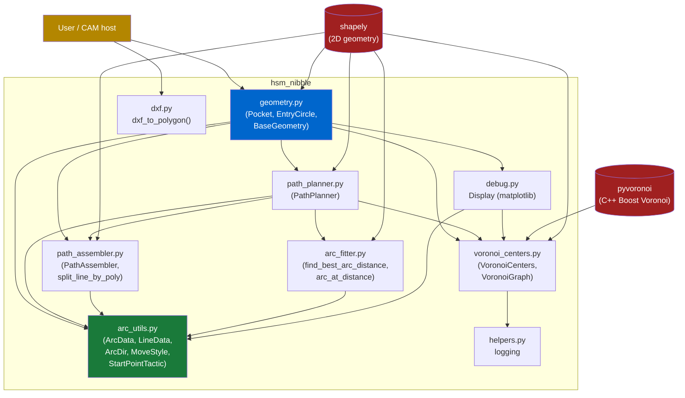
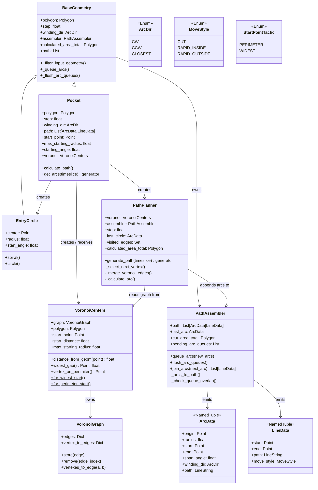
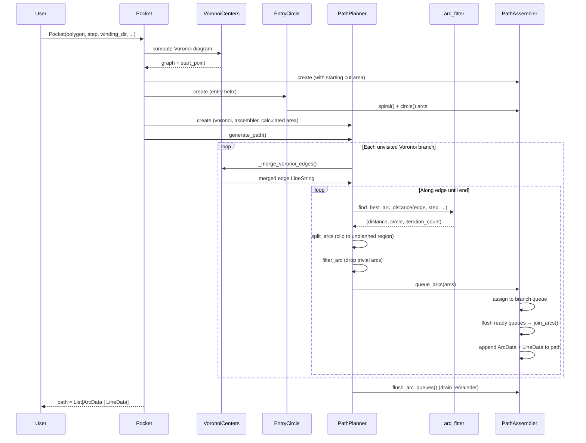

# HSM Nibble — Architecture Overview

A guide for new developers. Covers module layout, key classes, and the execution flow from user call to output path.

---

## Module Dependency Graph



**`arc_utils.py` is a leaf** — no internal imports, defines all shared data types.  
**`geometry.py` is the root** — the only module a user needs to import directly.

---

## Key Classes



---

## Execution Flow



---

## Data Types in the Output Path

The `Pocket.path` list is the sole output. It contains two types of elements, interleaved:

```
path = [
    ArcData(origin, radius, start, end, span_angle, winding_dir, path),  ← tool cuts along arc
    LineData(start, end, path, move_style=CUT),                           ← short connecting cut
    ArcData(...),
    LineData(..., move_style=RAPID_INSIDE),                               ← rapid over already-cut area
    ArcData(...),
    LineData(..., move_style=RAPID_OUTSIDE),                              ← retract/rapid outside part
    ...
]
```

| Type | `move_style` / `winding_dir` | Meaning |
|---|---|---|
| `ArcData` | `CW` or `CCW` | Cut arc; tool follows arc path at feed rate |
| `LineData` | `CUT` | Short connecting move at feed rate |
| `LineData` | `RAPID_INSIDE` | Fast move over already-cut region (no material) |
| `LineData` | `RAPID_OUTSIDE` | Fast move; retract above part first |

---

## Arc Fitter: Bisection Algorithm

`find_best_arc_distance()` in `arc_fitter.py` is the core mathematical kernel.  
It places arcs so the gap between consecutive arcs equals the desired `step`.

```
Two spacing metrics depending on context:
  • _area_spacing      — new branch: place arc step away from already-cut boundary
  • _hausdorff_spacing — continuing: place arc so Hausdorff distance from prev arc ≈ step

Bisection approach:
  lo = current position   hi = edge end
  repeat up to 30 times:
      mid = (lo + hi) / 2
      if spacing(mid) < step:  lo = mid   ← too close, move outward
      else:                    hi = mid   ← too far, move inward
  return best_distance when |spacing - step| < step/20
```

---

## Typical User Code

```python
import ezdxf
from hsm_nibble import dxf, geometry
from hsm_nibble.arc_utils import ArcData, LineData, ArcDir, MoveStyle

# 1. Load geometry from a DXF file
dxf_data = ezdxf.readfile("part.dxf")
shape = dxf.dxf_to_polygon(dxf_data.modelspace())

# 2. Generate the toolpath
toolpath = geometry.Pocket(
    shape,
    step=1.0,             # radial spacing between arcs (mm)
    winding_dir=ArcDir.CW,
    generate=True,        # stream results incrementally
)

# 3. (optional) stream progress while generating
for progress in toolpath.get_arcs(timeslice=500):
    print(f"{progress:.0%}")

# 4. Consume the output path
for element in toolpath.path:
    if isinstance(element, ArcData):
        # arc cut: use origin, radius, start/end angles, winding_dir
        pass
    elif isinstance(element, LineData):
        if element.move_style == MoveStyle.RAPID_OUTSIDE:
            # retract, rapid, plunge
            pass
        else:
            # in-pocket move
            pass
```
